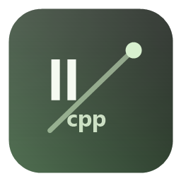

<div align="center">
  

  <h1>Llama.cpp Desktop</h1>

  <p>
    一个跨平台的本地 llama.cpp 桌面管理面板。
    <br />
    启动服务、配置模型、查看日志、直接聊天和接入 OpenAI 兼容客户端，都放在一个窗口里。
  </p>

  <p>
    <a href="README.md">English</a> · <a href="README.zh.md">中文</a>
  </p>

  <p>
    
    
    
    
    
    
  </p>
</div>


## 功能亮点

| 功能 | 说明 |
| --- | --- |
| 本地直连 | 直接启动 llama.cpp 目录里的 `llama-server`（Windows 为 `llama-server.exe`），不强依赖额外启动器 |
| OpenAI 兼容 | 默认提供 `http://127.0.0.1:8080/v1`，可接入 OpenClaw、Claude Code 等客户端 |
| 桌面聊天 | 内置网页端风格聊天页面，支持流式回复、历史对话、搜索和消息操作 |
| 附件入口 | 支持图片、文本、PDF 等附件，图片可在聊天里预览 |
| 模型信息 | 点击模型标签即可查看当前模型、上下文、GPU 层数和运行参数 |
| 终端日志 | 在客户端里查看 llama.cpp 输出，方便排查启动和推理问题 |
| 托盘后台 | 关闭窗口后隐藏到系统托盘，服务继续后台运行 |
| 参数配置 | 支持模型路径、上下文、采样、GPU 层数、线程和批处理参数 |

## 下载

> **注意**：本应用不包含 llama.cpp 二进制文件、模型文件和显卡驱动。你需要本机已有可用的 llama.cpp 环境。

请从 [Releases](https://github.com/minfaatong/llama-cpp-desktop/releases) 页面下载最新版本。根据你的平台选择对应文件：

| 平台 | 架构 | 文件 |
|------|------|------|
| Windows | x64 | `Llama.cpp-Desktop-{version}-win-x64.exe` |
| macOS | Apple Silicon (M1+) | `Llama.cpp-Desktop-{version}-mac-arm64.dmg` |
| Linux | x64 | `Llama.cpp-Desktop-{version}-linux-x64.AppImage` |
| Linux | ARM64 | `Llama.cpp-Desktop-{version}-linux-arm64.AppImage` |

## 快速开始

1. 下载并运行对应操作系统的文件。
2. 在设置中选择你的 llama.cpp 目录（Windows 选 `llama-server.exe`，macOS/Linux 选 `llama-server`）。
3. 选择一个 GGUF 模型文件。
4. 保存配置并启动服务。
5. 使用内置聊天，或把 `http://127.0.0.1:8080/v1` 接入 OpenAI 兼容客户端。

## 开发运行

```bash
npm install
npm start
```

## 打包

```bash
npm run dist
```

打包产物会生成在 `dist/`，该目录不会提交到 Git。

## 当前限制 / Roadmap

- 项目不内置 llama.cpp、模型文件、显卡驱动或 CUDA / Vulkan 运行库，需要用户本机已有可用环境。
- 图片可以上传和预览，但真正理解图片需要视觉模型和对应的 `mmproj` 多模态投影文件。
- 普通文本模型不能因为上传了图片就自动具备看图能力。视频理解当前暂未支持。
- ngram、多 GPU、speculative decoding 等高级能力可以先通过"自定义附加参数"传给本机 `llama-server`，具体是否生效取决于本地 llama.cpp 版本。
- 如果桌面端速度和原生命令行差异明显，请先复制"最终启动命令"，对比 GPU layers、上下文、batch、ubatch、threads 等参数。
- Qwen 等 thinking 模型是否输出 `<think>` 内容取决于模型、模板和 `chat_template_kwargs`；桌面端会解析并折叠展示返回中的 `<think>...</think>`。

## 项目结构

```text
assets/      图标和托盘图标
desktop/     Electron 主进程和预加载脚本
renderer/    桌面端界面
scripts/     图标生成脚本
```

## 开源说明

本仓库只包含桌面端源码，不包含：

- llama.cpp 二进制文件
- GGUF / GGML 模型文件
- 打包生成的 exe / dmg / AppImage
- 本地配置文件和运行日志

## License

MIT
